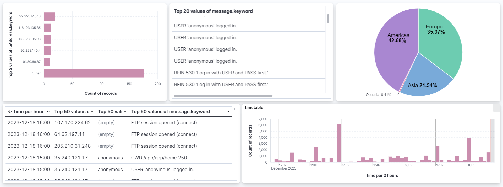

# Honeypot 3.0

Honeypot 3.0 is a Python application with ElasticSearch/Kibana that enables the creation of a customizable honeypot for the following services: 
- Telnet 
- SSH
- Modbus
- FTP

## Telnet Service
Simulates a Telnet service where the attacker attempts access (without a password), and the server responds positively. The attacker can use various commands typical of a Linux shell, such as ls, cd, whoami, echo, etc.

## SSH Service
Simulates an SSH service where the attacker attempts access. Using the credentials "root" and "root," the attacker successfully logs into the server, which responds positively. The attacker can utilize various commands typical of a Linux shell, such as ls, cd, whoami, echo, etc.

## MODBUS Service
Simulates a MODBUS service where the attacker must possess a MODBUS client to access a fictitious device. Subsequently, they believe they can perform read and write operations on various registers.

## FTP
Simulates an FTP service, offering both anonymous and username/password login modes. The system deceives the attacker into thinking they can add, modify, or delete files. In reality, they are in a subdirectory where all changes are reverted upon logout.

It is possible to monitor server activities using the data collected on Elasticsearch and visualizing it with Kibana.

## KIBANA's dashboard

## Start Script

